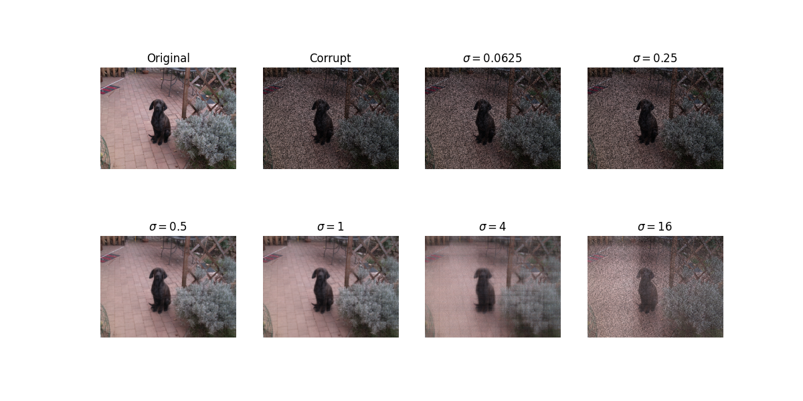

# Regularized Image Inpainting

This repository contains an implementation of a convex optimization-based approach to the **Regularized Image Inpainting Problem**.

## Problem Description
The goal is to recover a digital color image $X \in \mathbb{R}^{M \times 3N}$ from a corrupted version $X_{corrupt}$. The image is represented by three channels (Red, Green, Blue) stored side-by-side:
$$X = [X_R \quad X_G \quad X_B]$$

A corruption mask $\Omega \in \mathbb{R}^{M \times N}$ identifies damaged pixels (where $\Omega(i,j) = 0$). The corruption operator $\mathcal{A}$ is defined as the entrywise Hadamard product:
$$\mathcal{A}(X) = [\Omega \odot X_R \quad \Omega \odot X_G \quad \Omega \odot X_B]$$

### Mathematical Definition
The inpainting task is framed as a minimization problem using nuclear norm regularization to promote low-rank structures in the recovered image:

\[
\min_{X} \left\{ \frac{1}{2}\|\mathcal{A}(X) - X_{corrupt}\|_2^2 + \sigma\|X\|_* + \sigma\|\tilde{X}\|_* \right\}
\]

Where:
* $\sigma > 0$ is a regularization parameter.
* $\|Z\|_*$ denotes the **nuclear norm** (sum of singular values).
* $\tilde{X} = [X_R^T \quad X_G^T \quad X_B^T]^T$ represents the vertically stacked channels.

### Algorithm
The solution is reached by finding a fixed point of the operator $T$:
$$T(Y) = Y - \text{prox}_{\gamma g}(Y) + \text{prox}_{\gamma f}(2\text{prox}_{\gamma g}(Y) - Y - \gamma\mathcal{A}(\text{prox}_{\gamma g}(Y) - X_{corrupt}))$$

Iterating $Y_{k+1} = T(Y_k)$ ensures that $\text{prox}_{\gamma g}(Y)$ converges to the optimal solution for appropriate functions $f$ and $g$.

## Repository Structure

* **`algorithm.py`**: Contains the core logic for the iterative inpainter. It implements the sequence generation $Y_{k+1} = T(Y_k)$ to find the approximate solution for the regularized problem.
* **`utils.py`**: A comprehensive collection of mathematical tools and helper functions, including:
    * Definitions for proximal operators ($\text{prox}_{\gamma f}$ and $\text{prox}_{\gamma g}$).
    * The linear operator $\mathcal{A}$ for image corruption.
    * Nuclear norm calculation tools.
    * Plotting functions to visualize the original, corrupted, and reconstructed images across various $\sigma$ parameters.

## Results

  
   
  <em>Figure 1: Images obtained for different values of σ with γ = 1 and 50% erased pixels.</em>

